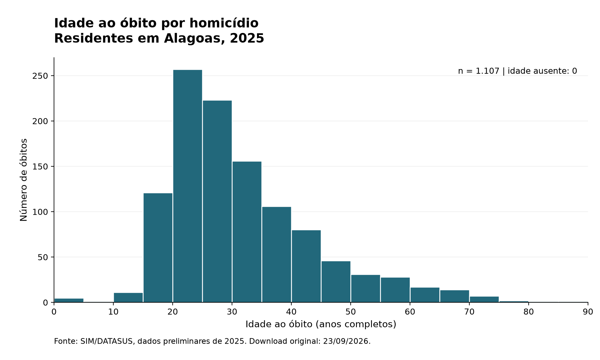

# Trabalho de Bioestatística

**Homicídios, juventude e raça/cor — Enunciado nº 2**  
Universidade Federal do Triângulo Mineiro (UFTM) — Medicina — Turma 101

**Integrantes:** Gabriel Martins, Hadassah Teodoro e Ruanytha Miranda.  
**Disciplina:** Bioestatística.  
**Professora:** Ana Paula Fernandes.

# Nome(s): Gabriel Martins, Hadassah Teodoro e Ruanytha Miranda
# Matrícula(s): d202510498, d202520450 e d202520419
# Enunciado n: 2
#
# DECLARAÇÃO DE USO DE INTELIGÊNCIA ARTIFICIAL
# Usei ferramenta de IA neste trabalho? ( ) Não (X) Sim
#
# Se sim:
# Qual(is) ferramenta(s): ChatGPT (por meio do Codex) para realizar a criação do código 5 em diante e Claude para auxiliar na interpretação e extração de dados FTP.
#
# Em quais partes usei (seja específico):
# Claude: auxílio na elaboração do rascunho de tratamento das variáveis.
# ChatGPT/Codex: revisão e conclusão dos códigos da Parte 1,
# conferência da codificação das variáveis, organização dos arquivos,
# execução e verificação dos resultados e apoio à documentação.
#
# O que pedi a ela:
# Auxílio para interpretar e tratar as variáveis do SIM, concluir
# somente a Parte 1 em Python e organizar do arquivo 5 em diante,
# números de controle, exclusões, tabela de frequências, histograma
# e limitações da base.
#
# O que eu alterei ou corrigi na resposta dela:
# Na revisão assistida, foram corrigidos o caminho do arquivo CSV,
# a codificação das unidades de IDADE, o tratamento de IDADE=999
# e SEXO=0, o dicionário e os comentários com os resultados obtidos.
# Os códigos foram executados e os números conferidos na base
# original baixada em 23/09/2026.
#
# Declaro que compreendo todo o código que estou entregando e que sou
# capaz de explicá-lo oralmente.
# ---------------------------------------------------------------
## Sobre o projeto

Este projeto reúne os códigos e os resultados da **Parte 1** do trabalho de Bioestatística. Utiliza os microdados do Sistema de Informações sobre Mortalidade (SIM/DATASUS), referentes aos **óbitos de residentes em Alagoas, em 2025**.

A pergunta que orienta o trabalho é: entre homens de 15 a 29 anos que morreram em Alagoas, a raça/cor negra está associada ao óbito por homicídio? O perfil das vítimas varia conforme o meio empregado?

O trabalho foi desenvolvido em **Python**, conforme a autorização da professora.

## Fonte dos dados

- **Sistema:** SIM — Sistema de Informações sobre Mortalidade.
- **Fonte:** DATASUS, arquivo `DOAL2025.dbc`, diretório `SIM/PRELIM/DORES`.
- **Recorte:** óbitos não fetais de residentes em Alagoas, ano de 2025.
- **Data do download original:** 23/09/2026.
- **Situação da base:** preliminar, sujeita a atualizações.
- **Dimensão original:** 22.936 observações e 87 variáveis.

Os arquivos originais foram preservados. A base tratada é salva separadamente, e a proveniência da cópia utilizada está registrada em `dados/proveniencia_original.json`.

## Organização dos arquivos

```text
Trabalho_Bioestatistica/
├── dados/
│   ├── DOAL2025.dbc
│   ├── DOAL2025.csv
│   ├── DOAL2025_tratado.csv
│   ├── homens_15_29_negra_branca.csv
│   ├── numeros_controle.json
│   ├── proveniencia_original.json
│   ├── conferencias/
│   ├── tabelas/
│   └── graficos/
├── python/
│   ├── 01_download_sim.py
│   ├── 02_processar_sim.py
│   ├── 03_conferencia_variaveis.py
│   ├── 04_dicionario_variaveis.py
│   ├── 05_tratamento_variaveis.py
│   ├── 06_numeros_controle.py
│   ├── 07_tabela_frequencias.py
│   ├── 08_histograma_idade.py
│   ├── 09_limitacoes_e_erros.py
│   └── historico/
├── entrega/
│   └── Parte1_Gabriel_Hadassah_Ruanytha.py
├── r/
├── requirements.txt
├── LEIA_ME.md
└── README.md
```

A pasta `r` foi mantida da organização inicial. As etapas desta versão estão implementadas em Python. O DBF original, quando presente, também permanece na pasta `dados`.

## Como executar

Utilize **Python 3.12**. Abra a pasta do projeto no terminal e instale as bibliotecas:

```powershell
python -m pip install -r requirements.txt
```

### Executar por etapas

Execute os arquivos na ordem:

```powershell
python python/01_download_sim.py
python python/02_processar_sim.py
python python/03_conferencia_variaveis.py
python python/04_dicionario_variaveis.py
python python/05_tratamento_variaveis.py
python python/06_numeros_controle.py
python python/07_tabela_frequencias.py
python python/08_histograma_idade.py
python python/09_limitacoes_e_erros.py
```

Os dois primeiros scripts aproveitam os arquivos locais quando já existem. Se o CSV original estiver disponível, é possível continuar a partir do `05`. Os arquivos seguintes utilizam a base tratada criada nessa etapa.

### Executar a versão única

A versão de entrega reúne as nove etapas em um único arquivo:

```powershell
python entrega/Parte1_Gabriel_Hadassah_Ruanytha.py
```

Antes da entrega, devem ser preenchidas as matrículas e revisada a declaração de uso de IA no cabeçalho.

## Variáveis e tratamento

As variáveis centrais são `CAUSABAS`, `IDADE`, `SEXO`, `RACACOR`, `ESC`, `LOCOCOR` e `CODMUNRES`. Os campos `DTOBITO` e `TIPOBITO` auxiliam na conferência do recorte.

- **Idade:** conversão do código do SIM para anos completos, considerando a unidade indicada pelo primeiro dígito. Códigos ignorados permanecem ausentes; menores de um ano recebem zero anos completos.
- **Homicídio:** identificação das agressões pelas categorias CID-10 de X85 a Y09.
- **Raça/cor:** preservação das categorias originais e criação do contraste negra — preta e parda — versus branca. Amarela, indígena e ausências ficam fora somente desse contraste.
- **Meio empregado:** arma de fogo para X93–X95, objeto cortante para X99 e outros para as demais agressões do agrupamento.
- **Escolaridade:** tratamento como faixas ordenadas de anos de estudo.
- **Informações ignoradas:** identificação como ausentes nas variáveis tratadas, sem exclusão indiscriminada de linhas da base geral.

Cada seleção registra quantas observações foram excluídas e o motivo. O dicionário e as justificativas completas estão nos scripts.

## Resultados da Parte 1

### Números de controle

| Controle | Resultado |
|---|---:|
| Homicídios, todas as idades e ambos os sexos | 1.107 |
| Óbitos por qualquer causa entre 15 e 29 anos, ambos os sexos | 1.365 |
| Homicídios por arma de fogo | 832 |
| Homicídios com raça/cor ignorada ou em branco | 12 |

### Meio empregado nos homicídios

| Meio | n | % |
|---|---:|---:|
| Arma de fogo | 832 | 75,16 |
| Objeto cortante | 132 | 11,92 |
| Outros | 143 | 12,92 |
| **Total** | **1.107** | **100,00** |

O denominador dos percentuais é o total de homicídios de residentes em Alagoas, de todas as idades e ambos os sexos.

O recorte de homens de 15 a 29 anos contém **1.124 observações**. O contraste negra versus branca contém **1.104**, após retirar somente desse contraste 14 registros sem raça/cor, um de raça/cor amarela e cinco de raça/cor indígena.

### Histograma da idade ao óbito



O gráfico inclui os 1.107 homicídios, sem exclusões por idade ignorada. Fonte: SIM/DATASUS, dados preliminares de 2025, download em 23/09/2026.

### Conferência da execução

Os nove arquivos foram executados separadamente e a versão única também foi executada. As duas formas produziram os mesmos dados tratados, recorte, controles, tabela de meios, tabela de exclusões e histograma.

Esses resultados correspondem à cópia de 23/09/2026. Um novo download pode apresentar diferenças devido à atualização dos dados preliminares.

## Limitações

O SIM registra óbitos e não fornece, nesta base, um denominador de pessoas vivas. Portanto, a proporção de homicídios entre os óbitos não representa o risco populacional de morrer por homicídio.

Sub-registro, causas imprecisas, eventos de intenção indeterminada e informações ausentes podem afetar os resultados. A raça/cor é a registrada na declaração de óbito, sem garantia de autodeclaração pelo falecido. A descrição apresentada não demonstra causalidade e não deve ser generalizada automaticamente para outros estados ou anos.

## Declaração de uso de inteligência artificial

**Foram utilizadas as ferramentas ChatGPT e Claude como apoio à elaboração deste trabalho.**

| Ferramenta | Uso no projeto |
|---|---|
| **Claude** | Apoio à formulação do rascunho de tratamento das variáveis, registrado no passo a passo inicial. |
| **ChatGPT, por meio do Codex** | Revisão da codificação e dos caminhos dos arquivos; conclusão dos itens da Parte 1; organização dos scripts; execução e conferência dos resultados; apoio à documentação, ao texto em LaTeX e a este README. |

O apoio de IA incluiu a geração e a revisão de código e de explicações. Durante a revisão, foram corrigidos o caminho do CSV, a interpretação das unidades de idade, o tratamento dos códigos ignorados e o dicionário das variáveis. Os resultados numéricos apresentados foram obtidos pela execução dos scripts sobre a base fornecida e conferidos nessa cópia.


## Referências

- Enunciado nº 2 e Guia do estudante da disciplina, fornecidos pela professora.
- [DATASUS](https://datasus.saude.gov.br/).
- [Codificação e tratamento do SIM no microdatasus](https://github.com/rfsaldanha/microdatasus/blob/master/R/process_sim.R).
- [Documentação do datasus-dbc para Python](https://github.com/mymatsubara/datasus-dbc-py).
- [Estatuto da Igualdade Racial — Lei nº 12.288/2010](https://planalto.gov.br/ccivil_03/_ato2007-2010/2010/lei/l12288.htm).
